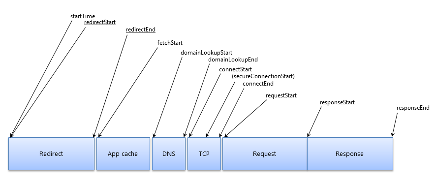

# Performance

`Performance` 接口可以获取到当前页面中与性能相关的信息。

我们可以使用 `window.performance` 提供了一组精确的数据，经过简单的计算就能得出一些网页性能数据。

先在chrome浏览器的控制台中输入`window.performance`看下出现什么。


## 属性

1.`performance.memory`其是 Chrome 添加的一个非标准扩展，描述基本内存使用情况。

```angular2html
window.performance.memory;
//memory对象格式
memory:{
    jsHeapSizeLimit:1136000000,// 内存大小限制
    totalJSHeapSize:11200000,// 可使用的内存
    usedJSHeapSize:10000000 // JS 对象（包括V8引擎内部对象）占用的内存，一定小于 totalJSHeapSize
}
```

2.`Performance.navigation` 这个对象表示出现在当前浏览上下文的 navigation 类型，比如获取某个资源所需要的重定向次数

```angular2html
navigation: {
    redirectCount: 0, // 如果有重定向的话，页面通过几次重定向跳转而来
    type: 0           // 0   即 TYPE_NAVIGATENEXT 正常进入的页面（非刷新、非重定向等）
                      // 1   即 TYPE_RELOAD       通过 window.location.reload() 刷新的页面
                      // 2   即 TYPE_BACK_FORWARD 通过浏览器的前进后退按钮进入的页面（历史记录）
                      // 255 即 TYPE_UNDEFINED    非以上方式进入的页面
}
```

3.`Performance.onresourcetimingbufferfull`是一个回调的 EventTarget，当触发 resourcetimingbufferfull 事件的时候会被调用。

4.`Performance.timeOrigin`: 性能测量开始时的时间的高精度时间戳。

5.`Performance.timing`: 对象包含了各种与浏览器性能有关的时间数据，提供浏览器处理网页的各个阶段的耗时.

先看下一个请求发出的整个过程中，各种环节的时间顺序：


具体含义：

```
timing: {
        navigationStart：当前浏览器窗口的前一个网页关闭，发生unload事件时的Unix毫秒时间戳。如果没有前一个网页，则等于fetchStart属性。
        
        unloadEventStart：如果前一个网页与当前网页属于同一个域名，则返回前一个网页的unload事件发生时的Unix毫秒时间戳。如果没有前一个网页，或者之前的网页跳转不是在同一个域名内，则返回值为0。
        
        unloadEventEnd：如果前一个网页与当前网页属于同一个域名，则返回前一个网页unload事件的回调函数结束时的Unix毫秒时间戳。如果没有前一个网页，或者之前的网页跳转不是在同一个域名内，则返回值为0。
        
        redirectStart：返回第一个HTTP跳转开始时的Unix毫秒时间戳。如果没有跳转，或者不是同一个域名内部的跳转，则返回值为0。
        
        redirectEnd：返回最后一个HTTP跳转结束时（即跳转回应的最后一个字节接受完成时）的Unix毫秒时间戳。如果没有跳转，或者不是同一个域名内部的跳转，则返回值为0。
        
        fetchStart：返回浏览器准备使用HTTP请求读取文档时的Unix毫秒时间戳。该事件在网页查询本地缓存之前发生。
        
        domainLookupStart：返回域名查询开始时的Unix毫秒时间戳。如果使用持久连接，或者信息是从本地缓存获取的，则返回值等同于fetchStart属性的值。
        
        domainLookupEnd：返回域名查询结束时的Unix毫秒时间戳。如果使用持久连接，或者信息是从本地缓存获取的，则返回值等同于fetchStart属性的值。
        
        connectStart：返回HTTP请求开始向服务器发送时的Unix毫秒时间戳。如果使用持久连接（persistent connection），则返回值等同于fetchStart属性的值。
        
        connectEnd：返回浏览器与服务器之间的连接建立时的Unix毫秒时间戳。如果建立的是持久连接，则返回值等同于fetchStart属性的值。连接建立指的是所有握手和认证过程全部结束。
        
        secureConnectionStart：返回浏览器与服务器开始安全链接的握手时的Unix毫秒时间戳。如果当前网页不要求安全连接，则返回0。
        
        requestStart：返回浏览器向服务器发出HTTP请求时（或开始读取本地缓存时）的Unix毫秒时间戳。
        
        responseStart：返回浏览器从服务器收到（或从本地缓存读取）第一个字节时的Unix毫秒时间戳。
        
        responseEnd：返回浏览器从服务器收到（或从本地缓存读取）最后一个字节时（如果在此之前HTTP连接已经关闭，则返回关闭时）的Unix毫秒时间戳。
        
        domLoading：返回当前网页DOM结构开始解析时（即Document.readyState属性变为“loading”、相应的readystatechange事件触发时）的Unix毫秒时间戳。
        
        domInteractive：返回当前网页DOM结构结束解析、开始加载内嵌资源时（即Document.readyState属性变为“interactive”、相应的readystatechange事件触发时）的Unix毫秒时间戳。
        
        domContentLoadedEventStart：返回当前网页DOMContentLoaded事件发生时（即DOM结构解析完毕、所有脚本开始运行时）的Unix毫秒时间戳。
        
        domContentLoadedEventEnd：返回当前网页所有需要执行的脚本执行完成时的Unix毫秒时间戳。
        
        domComplete：返回当前网页DOM结构生成时（即Document.readyState属性变为“complete”，以及相应的readystatechange事件发生时）的Unix毫秒时间戳。
        
        loadEventStart：返回当前网页load事件的回调函数开始时的Unix毫秒时间戳。如果该事件还没有发生，返回0。
        
        loadEventEnd：返回当前网页load事件的回调函数运行结束时的Unix毫秒时间戳。如果该事件还没有发生，返回0。
```

## 使用 performance.timing 信息简单计算出网页性能数据

```js
// 计算加载时间
function getPerformanceTiming () {  
    var performance = window.performance;
 
    if (!performance) {
        // 当前浏览器不支持
        console.log('你的浏览器不支持 performance 接口');
        return;
    }
 
    var t = performance.timing;
    var times = {};
 
    //【重要】页面加载完成的时间
    //【原因】这几乎代表了用户等待页面可用的时间
    times.loadPage = t.loadEventEnd - t.navigationStart;
 
    //【重要】解析 DOM 树结构的时间
    //【原因】反省下你的 DOM 树嵌套是不是太多了！
    times.domReady = t.domComplete - t.responseEnd;
 
    //【重要】重定向的时间
    //【原因】拒绝重定向！比如，http://example.com/ 就不该写成 http://example.com
    times.redirect = t.redirectEnd - t.redirectStart;
 
    //【重要】DNS 查询时间
    //【原因】DNS 预加载做了么？页面内是不是使用了太多不同的域名导致域名查询的时间太长？
    // 可使用 HTML5 Prefetch 预查询 DNS ，见：[HTML5 prefetch](http://segmentfault.com/a/1190000000633364)            
    times.lookupDomain = t.domainLookupEnd - t.domainLookupStart;
 
    //【重要】最初的网络请求被发起 到 从服务器接收到第一个字节 的时间
    //【原因】这可以理解为用户拿到你的资源占用的时间，加异地机房了么，加CDN 处理了么？加带宽了么？加 CPU 运算速度了么？
    // TTFB 即 Time To First Byte 的意思
    // 维基百科：https://en.wikipedia.org/wiki/Time_To_First_Byte
    times.ttfb = t.responseStart - t.navigationStart;
 
    //【重要】内容加载完成的时间
    //【原因】页面内容经过 gzip 压缩了么，静态资源 css/js 等压缩了么？
    times.request = t.responseEnd - t.requestStart;
 
    //【重要】执行 onload 回调函数的时间
    //【原因】是否太多不必要的操作都放到 onload 回调函数里执行了，考虑过延迟加载、按需加载的策略么？
    times.loadEvent = t.loadEventEnd - t.loadEventStart;
 
    // DNS 缓存时间
    times.appcache = t.domainLookupStart - t.fetchStart;
 
    // 卸载页面的时间
    times.unloadEvent = t.unloadEventEnd - t.unloadEventStart;
 
    // TCP 建立连接完成握手的时间
    times.connect = t.connectEnd - t.connectStart;
 
    return times;
}
```


## 方法

1.`performance.now()`

`performance.now`方法返回当前网页自从`performance.timing.navigationStart`到当前时间之间的微秒数（毫秒的千分之一）。也就是说，它的精度可以达到100万分之一秒。

```
performance.now() 
// 2372064.5999999833
```

通过两次调用performance.now方法，可以得到间隔的准确时间，用来衡量某种操作的耗时。

2.`performance.mark()`

可以使用 performance.mark() 标记各种时间戳。如：


`Performance.clearMarks()`方法用于清除标记，如果不加参数，就表示清除所有标记。

3.`performance.getEntries()`

使用performance.getEntries() 获取所有资源请求的时间数据，这个函数返回的将是一个数组，包含了页面中所有的 HTTP 请求


## 参考链接：
https://developer.mozilla.org/zh-CN/docs/Web/API/Window/performance

http://javascript.ruanyifeng.com/bom/performance.html

http://www.alloyteam.com/2015/09/explore-performance/

