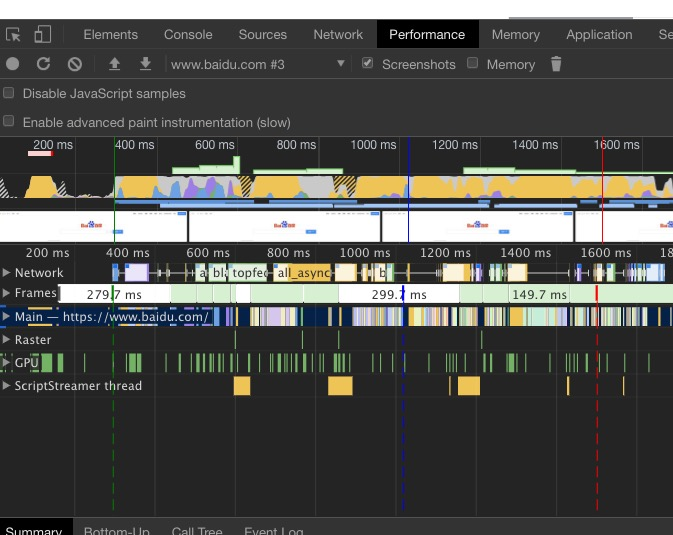

https://developers.google.com/web/tools/chrome-devtools/evaluate-performance/timeline-tool?hl=zh-cn

https://github.com/JohnsenZhou/Front-End-Performance-Checklist#table-of-contents

打开一个网站，如www.baidu.com,右键 检查，点Performance，

然后点击左上角的刷新按钮，就会显示页面加载的信息。
 
 
在事件瀑布面板会有三条虚线，绿色的表示第一次开始绘制页面，蓝色线代表DOM已加载完成，红色线表示页面加载完(包括资源引用)

### google light house
https://developers.google.com/speed/pagespeed/insights/

https://developers.google.com/web/tools/lighthouse/
