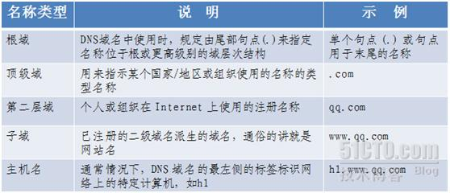
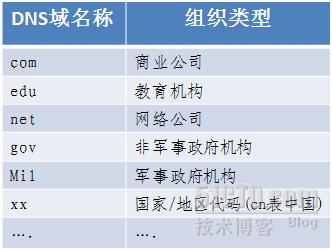

# DNS是什么

维基百科解释：域名系统（英文：Domain Name System，缩写：DNS）是互联网的一项服务。
它作为将域名和IP地址相互映射的一个分布式数据库，能够使人更方便地访问互联网。
DNS使用TCP和UDP端口53[1]。
查询端口是53（DNS服务器的默认端口）.
当前，对于每一级域名长度的限制是63个字符，域名总长度则不能超过253个字符。

## DNS解析

维基百科：域名解析

举一个例子，zh.wikipedia.org 作为一个域名就和IP地址198.35.26.96 相对应。
DNS就像是一个自动的电话号码簿，我们可以直接拨打198.35.26.96 的名字zh.wikipedia.org 来代替电话号码（IP地址）。
DNS在我们直接调用网站的名字以后就会将像zh.wikipedia.org 一样便于人类使用的名字转化成像198.35.26.96 一样便于机器识别的IP地址。

## DNS域名称空间的组织方式

## DNS 和 Internet 域

## DNS 缓存

当用户在浏览器中输入网址的地址后，浏览器要做的第一件事就是解析 DNS：

(1) 浏览器检查缓存中是否有域名对应的 IP，如果有就结束 DNS 解析过程。浏览器中的 DNS 缓存有时间和大小双重限制，时间一般为几分钟到几个小时不等。DNS 缓存时间过长会导致如果 IP 地址发生变化，无法解析到正确的 IP 地址；时间过短会导致浏览器重复解析域名。

(2) 如果浏览器缓存中没有对应的 IP 地址，浏览器会继续查找操作系统缓存中是否有域名对应的 DNS 解析结果。我们可以通过在操作系统中设置 hosts 文件来设置 IP 与域名的关系。

(3) 如果还没有拿到解析结果，操作系统就会把域名发送给本地区的域名服务器（LDNS），LDNS 通常由互联网服务提供商（ISP）提供，比如电信或者联通。这个域名服务器一般在城市某个角落，并且性能较好，当拿到域名后，首先也是从缓存中查找，看是否有匹配的结果。一般来说，大多数的 DNS 解析到这里就结束了，所以 LDNS/ISP DNS 承担了大部分的域名解析工作。如果缓存中有 IP 地址，就直接返回，并且会被标记为非权威服务器应答。

##减少 DNS 解析，我们前端能做什么？

### DNS预解析；

可以通过 meta 信息告诉浏览器，页面需要做 DNS 预解析。

`<meta http-equiv="x-dns-prefetch-control" content="on" />`

通过 link 标签强制 DNS 预解析
`<link rel="dns-prefetch" href="https://lz5z.com" />`