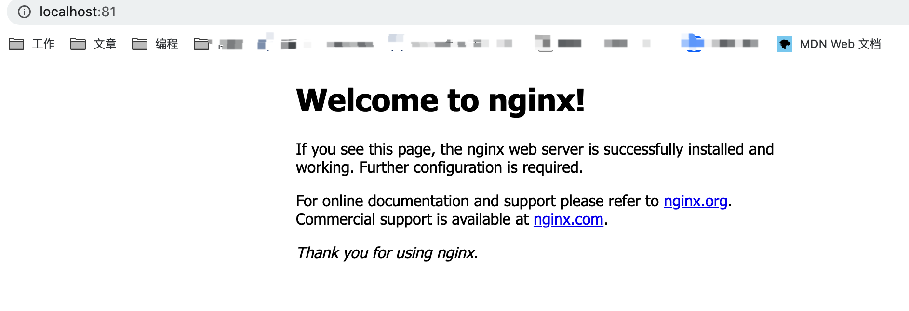
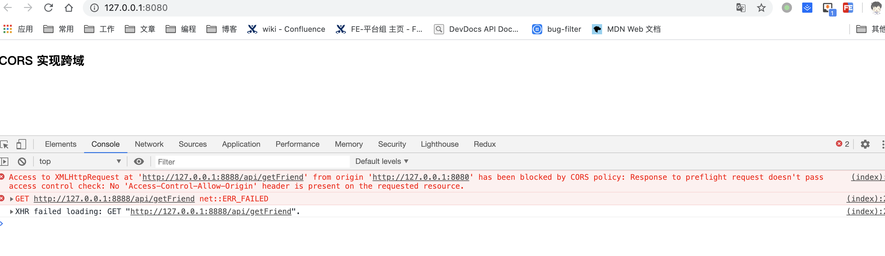
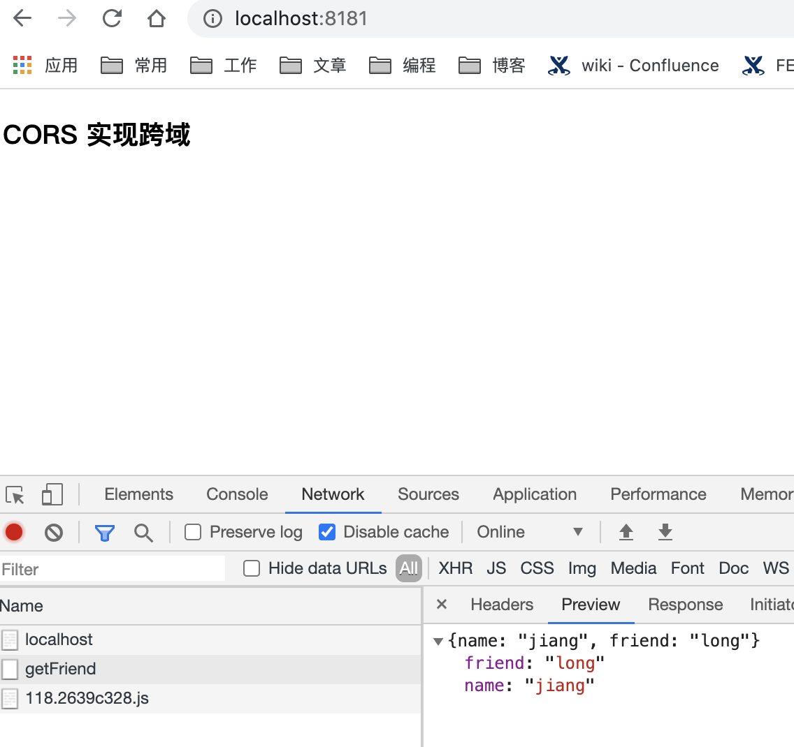

# 使用nginx反向代理解决跨域问题

### 安装nginx
安装：`brew install nginx`

启动nginx：`nginx`

安装成功后默认配置文件为`/usr/local/etc/nginx/nginx.conf`。文件内容如下。
默认端口为`80`端口，因为我的电脑`80`端口其他程序占用了，所以我改为`81`端口。

nginx 启动后, 浏览器打开 localhost:81, 即可验证. 出现以下界面说明安装成功.


```
#定义Nginx运行的用户和用户组
#user  nobody; 

#nginx进程数，建议设置为等于CPU总核心数。
worker_processes  1; 

#全局错误日志定义类型，[ debug | info | notice | warn | error | crit ]
#error_log  logs/error.log;
#error_log  logs/error.log  notice;
#error_log  logs/error.log  info;

#进程文件
#pid        logs/nginx.pid;

#工作模式与连接数上限
events {
    #单个进程最大连接数（最大连接数=连接数*进程数）
    worker_connections  1024;
}

#设定http服务器
http {
    #文件扩展名与文件类型映射表
    include       mime.types;
    #默认文件类型
    default_type  application/octet-stream;

    #log_format  main  '$remote_addr - $remote_user [$time_local] "$request" '
    #                  '$status $body_bytes_sent "$http_referer" '
    #                  '"$http_user_agent" "$http_x_forwarded_for"';

    #access_log  logs/access.log  main;

    #开启高效文件传输模式，sendfile指令指定nginx是否调用sendfile函数来输出文件，对于普通应用设为 on，如果用来进行下载等应用磁盘IO重负载应用，可设置为off，以平衡磁盘与网络I/O处理速度，降低系统的负载。注意：如果图片显示不正常把这个改 成off。
    sendfile        on;

    #防止网络阻塞
    #tcp_nopush     on;


    #长连接超时时间，单位是秒
    #keepalive_timeout  0;
    keepalive_timeout  65;

    #开启gzip压缩输出
    #gzip  on;

    #虚拟主机的配置
    server {
        #监听端口
        listen       81;

        #域名可以有多个，用空格隔开
        server_name  localhost;

        #默认编码
        #charset utf-8;

        #定义本虚拟主机的访问日志
        #access_log  logs/host.access.log  main;

        location / {
            root   html;
            index  index.html index.htm;
        }

        #error_page  404              /404.html;

        # redirect server error pages to the static page /50x.html
        #
        error_page   500 502 503 504  /50x.html;
        location = /50x.html {
            root   html;
        }

        # proxy the PHP scripts to Apache listening on 127.0.0.1:80
        #
        #location ~ \.php$ {
        #    proxy_pass   http://127.0.0.1;
        #}

        # pass the PHP scripts to FastCGI server listening on 127.0.0.1:9000
        #
        #location ~ \.php$ {
        #    root           html;
        #    fastcgi_pass   127.0.0.1:9000;
        #    fastcgi_index  index.php;
        #    fastcgi_param  SCRIPT_FILENAME  /scripts$fastcgi_script_name;
        #    include        fastcgi_params;
        #}

        # deny access to .htaccess files, if Apache's document root
        # concurs with nginx's one
        #
        #location ~ /\.ht {
        #    deny  all;
        #}
    }


    # another virtual host using mix of IP-, name-, and port-based configuration
    #
    #server {
    #    listen       8000;
    #    listen       somename:8080;
    #    server_name  somename  alias  another.alias;

    #    location / {
    #        root   html;
    #        index  index.html index.htm;
    #    }
    #}


    # HTTPS server
    #
    #server {
    #    listen       443 ssl;
    #    server_name  localhost;

    #    ssl_certificate      cert.pem;
    #    ssl_certificate_key  cert.key;

    #    ssl_session_cache    shared:SSL:1m;
    #    ssl_session_timeout  5m;

    #    ssl_ciphers  HIGH:!aNULL:!MD5;
    #    ssl_prefer_server_ciphers  on;

    #    location / {
    #        root   html;
    #        index  index.html index.htm;
    #    }
    #}

}
```


### 写一个简单的后端接口
```js
const http = require('http');

const PORT = 8888;

// 创建一个 http 服务
const server = http.createServer((request, response) => {
  console.log(request.headers)
  response.end("{name: 'jiangzx', friend: 'long'}");
});

// 启动服务, 监听端口
server.listen(PORT, () => {
  console.log('服务启动成功, 正在监听: ', PORT);
});

```
启动后端服务 `node server.js`


### 写一个简单的html页面发起一个ajax请求

```html
<!DOCTYPE html>
<html lang="en">
<head>
    <meta charset="UTF-8">
    <meta name="viewport" content="width=device-width, initial-scale=1.0">
    <meta http-equiv="X-UA-Compatible" content="ie=edge">
    <title>CORS 实现跨域</title>
</head>
<body>
    <h3>CORS 实现跨域</h3>

    <script>
        var xhr = new XMLHttpRequest()
        xhr.open('GET', 'http://127.0.0.1:8888/api/getFriend')
        xhr.setRequestHeader('token', 'abbc')
        xhr.withCredentials = true;
        xhr.onreadystatechange = function() {
            if(xhr.readyState === 4 && xhr.status === 200) {
                console.log(xhr.responseText)
                console.log(xhr.getAllResponseHeaders())
            }
        }
        xhr.send()
    </script>
</body>
</html>


```

然后启动前端服务,在我的项目路径下执行 `http-server`。[http-server](https://www.npmjs.com/package/http-server)是一个简单零配置的服务器。

打开`http://127.0.0.1:8080`就能看的我们的页面了。


### 创建跨域环境
此时打开页面，会看到请求接口有跨域问题。


那么接下来配置nginx。

### nginx配置

```
server {
   # 监听80端口号
   listen 8181;

   # 监听访问的域名
   server_name localhost;

   # 将nginxf服务http://localhost:8181 代理到 我们刚才写的页面 http://127.0.0.1:8080。
   location / {
       proxy_pass http://127.0.0.1:8080;
   }

   # 将api路径下的请求代理到我们的后端接口 http://127.0.0.1:8888
   location /api/ {
       # 把请求转发到 http://127.0.0.1:8888
       # proxy_pass http://127.0.0.1:8888;
   }
}

```
将html中的请求地址改为 /api/getFriend，`xhr.open('GET', '/api/getFriend')`
配置好后，执行 `nginx -s reload`重启，刷新页面请求成功了



参考文章：https://juejin.im/post/5c0e6d606fb9a049f66bf246#comment
